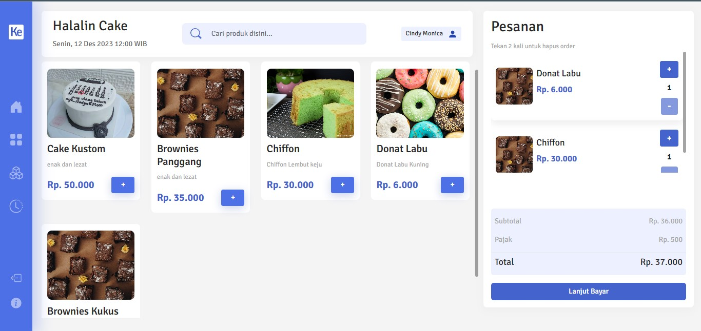
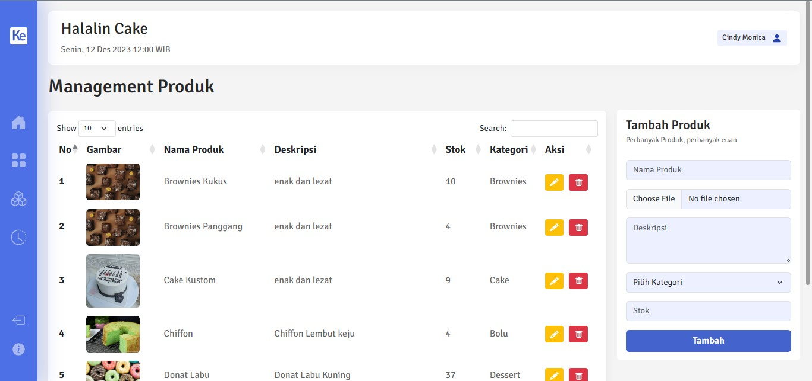

# Kaseer-WebApp-Demo.

> :warning: **Disclaimer:** Aplikasi Kaseer Web ini hanya demo saja.

### Preview Kaseer

##### Tools & Teknologi yang dipakai
- MYSQL
- DBeaver
- Intelij IDEA
- Java JDK 19

### Get Started
1. Buat Db baru di Dbeaver dengan nama <b>pos-app</b>.
2. Lakuakan restore DB <b>pos-app.sql</b> menggunakan Dbeaver <strong>(disarankan)</strong>.
3. Open project <b>be-pos-demo</b> menggunakan Intelij IDEA atau IDE lainnya.
4. Setting koneksi db pada file application.properties. <b>file path : be-pos-demo\src\main\resources\application.properties</b>
  `spring.datasource.url=jdbc:mysql://localhost:3306/pos-app
spring.datasource.username=root
spring.datasource.password=rizal`
  <b>sesuaikan username dan password dari koneksi msyql nya.</b>
5. Jika sudah melakukan semua diatas, maka jalankan aplikasi nya dngn ketik command pada terminal `mvn spring-boot:run`
6. Ctrl + C untuk stop aplikasi.

##### Find Me on
- Instagram : @rizalwibowoo
- Telegram : @Zalbowo

